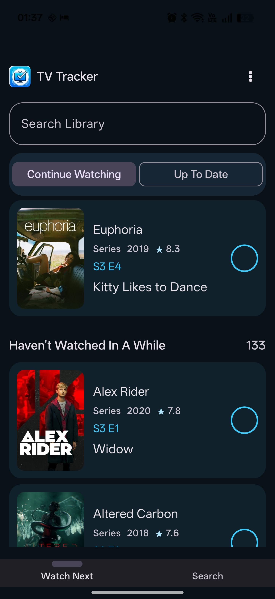
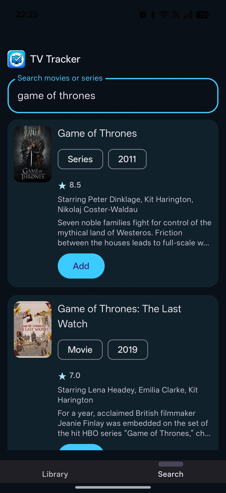
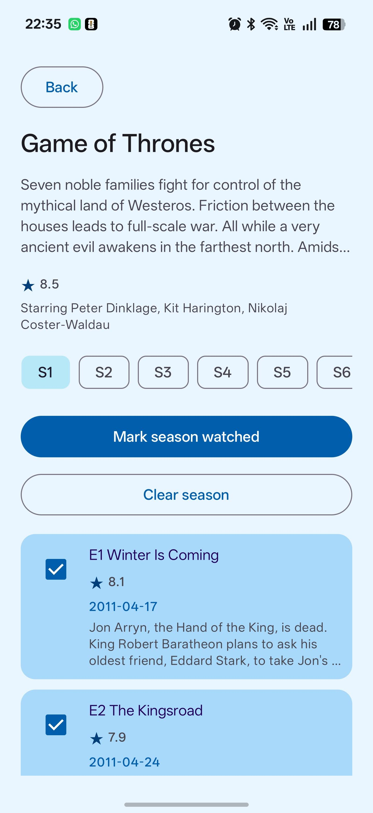
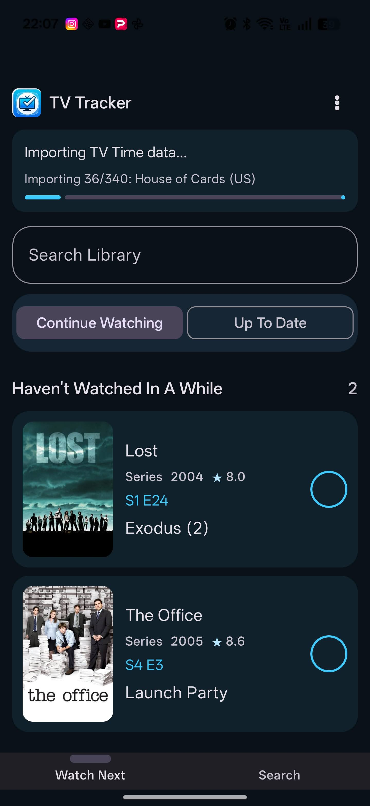
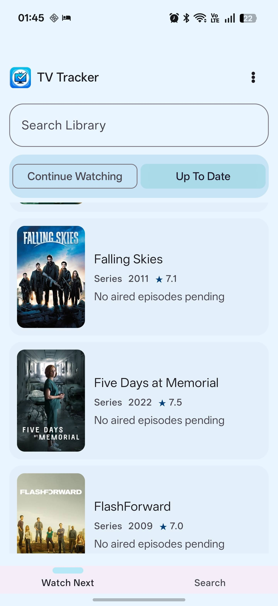
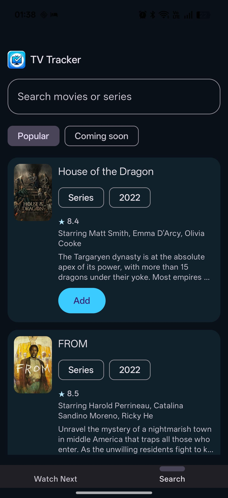

# TV Tracker

TV Tracker is a local-first Android app for tracking movies and TV series. It was started as a lightweight replacement for TV Time, focused on keeping your watch history on your own device while still using TMDb metadata for search, posters, ratings, cast, seasons, and episodes.

The app is currently an MVP. It stores watch data locally with Room and does not require an account or backend.

## Features

- Search movies and TV series using TMDb.
- Browse preloaded Popular and Coming Soon discovery lists in Search.
- Add movies and series to your local library.
- Mark movies as watched.
- Track TV episodes by season.
- Mark a full season as watched or clear a season.
- Use Watch Next to see the next unwatched aired episode for each series.
- Split Watch Next into Continue Watching, Haven't Watched In A While, and Up To Date views.
- View ratings, cast, posters, release dates, and episode metadata when available from TMDb.
- Get local notifications for newly aired unwatched episodes in your library.
- Import watched TV Time history from CSV files or a TV Tracker export zip.
- Export your local watch data as a zip in the same app-supported CSV format.
- Continue importing and loading episode metadata in the background with resumable progress.
- Choose system, light, or dark theme.

## Screenshots

| Library                                        | Search                                           | Episodes                                            |
|------------------------------------------------|--------------------------------------------------|-----------------------------------------------------|
|        |            |           |
|  |  |  |

## TMDb API Key

This app requires each user to provide their own TMDb API key. The key is saved locally on the device and is not committed to the repository.

To get a key:

1. Create or log in to a TMDb account.
2. Open the TMDb API documentation: https://developer.themoviedb.org/docs/getting-started
3. Go to your TMDb API settings: https://www.themoviedb.org/settings/api
4. Create an API key and copy it.
5. In the app, open `Watch Next -> menu -> TMDb API key` and paste it.

The app currently uses TMDb API v3 style API-key authentication.

## Import From TV Time

TV Tracker can import watched series and watched episodes from a TV Time GDPR data export.

TV Time GDPR export link:

- https://gdpr.tvtime.com/gdpr/self-service

After downloading your TV Time data, use `Watch Next -> menu -> Import from TV Time`.

You can select either:

- a TV Tracker export `.zip`, which the app will scan for supported CSV files; or
- separate CSV files from a TV Time export.

The minimum CSV files are:

- `user_tv_show_data.csv`
- `seen_episode_source.csv`

For better watched dates and fuller episode history, also include these files when available:

- `show_seen_episode_latest.csv`
- `tracking-prod-records-v2.csv`
- `tracking-prod-records.csv`

The importer uses these files to add watched series to your library and mark watched episodes locally. Imports run in background work and can resume from saved pending files if the app is interrupted. Larger libraries can still take a few minutes because the app matches TV Time data to TMDb metadata and saves episode records.

After the import finishes, Watch Next keeps loading episode metadata in the background. Episode metadata loading is resumable by series and season.

## Export Data

Use `Watch Next -> menu -> Export` to create a zip file containing CSV data in the same format supported by this app's importer.

The export currently includes:

- `user_tv_show_data.csv`
- `seen_episode_source.csv`
- `show_seen_episode_latest.csv`
- `tracking-prod-records-v2.csv`
- `tracking-prod-records.csv`

The export is useful for:

- keeping a local backup;
- moving data between installs;
- preparing for a future import/sync flow.

The export does not upload data anywhere.

## Local Data And Privacy

- Watch data is stored locally in an Android Room database.
- The TMDb API key is stored locally on the device.
- There is no backend account, cloud sync, or social graph in the current MVP.
- TMDb metadata and images are fetched from TMDb when needed.
- Imports, episode metadata loading, and notifications are handled locally by background work.

## Build And Run

Requirements:

- Android Studio or another Android-capable Gradle environment.
- Android SDK installed locally.
- JDK 17.

Setup:

1. Clone the repository.
2. Create `local.properties` from `local.properties.example` if Android Studio does not create it automatically.
3. Set your Android SDK path:

   ```properties
   sdk.dir=/path/to/android/sdk
   ```

4. Build the debug APK:

   ```bash
   ./gradlew assembleDebug
   ```

5. Install/run from Android Studio or install the generated debug APK.

Do not put a TMDb API key in `local.properties`. API keys are entered inside the app.

## Local APK Builds

To generate a local debug APK:

```bash
./gradlew assembleDebug
```

The APK will be created at:

```text
app/build/outputs/apk/debug/app-debug.apk
```

If you want to skip the hard part, you can download directly the last APK version from the following url:

- https://github.com/alexiszorba25/tvtracker/releases/latest

Users who install APKs directly may need to allow installation from unknown sources on their Android device.

## Tech Stack

- Kotlin
- Android native app
- Jetpack Compose and Material 3
- Room for local persistence
- WorkManager for imports, resumable metadata loading, periodic episode checks, and notifications
- Retrofit, OkHttp, and Moshi for TMDb API access
- Coil for poster images
- Gradle Kotlin DSL

## Roadmap Ideas

- Better import diagnostics and manual matching for unmatched shows.
- More robust long-running background import status.
- Online backup/sync.
- Web version.
- iOS version.
- Social features.
- Richer release calendar and upcoming season discovery.

## License

This project is source-available for personal, non-commercial use. See [LICENSE](LICENSE).

The app uses TMDb metadata but is not endorsed or certified by TMDb.
